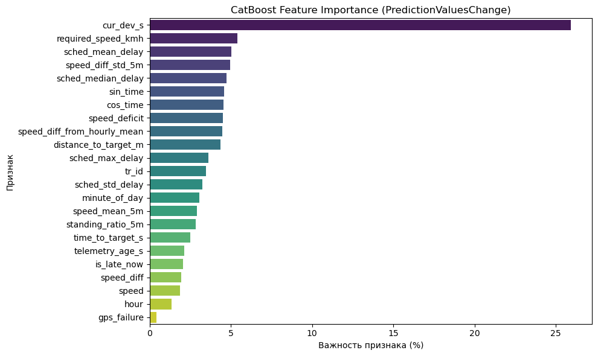

# ML-модуль: прогноз задержки на горизонте 10–15 минут

## Оглавление

- [1. Постановка задачи](#1-постановка-задачи)
- [2. Архитектура ML-модуля](#2-архитектура-ml-модуля)
- [3. Архитектура модели](#3-архитектура-модели)
- [4. Признаки](#4-признаки) · [важность признаков](#важность-признаков)
- [5. Обучение](#5-обучение)
- [6. Функциональность](#6-функциональность)
- [7. Метрики качества и результаты тестов](#7-метрики-качества-и-результаты-тестов)
- [8. Объяснение прогнозов (SHAP)](#8-объяснение-прогнозов-shap)
- [9. Дообучение](#9-дообучение)
- [10. Вероятность опоздания и уровень риска](#10-вероятность-опоздания-и-уровень-риска)

Связанные документы: [README](../README.md) · [Инструкция для жюри](JURY_GUIDE.md) · [API и архитектура сервиса](API.md) ·
[Sphinx: ML-модуль](code/ml.html)

---

## 1. Постановка задачи

| | |
|---|---|
| Момент прогноза T | Текущее время потока телеметрии |
| Цель | Фактическая задержка `target_delay_s` (с) на целевой остановке — первой остановке расписания ТС с плановым временем в окне **(T+10, T+15] мин** |
| Опорный признак | `cur_dev_s` — задержка на последней пройденной остановке, известная на момент T |
| Классы | early < −60 с · ontime · late > +120 с (те же пороги у уровней риска на дашборде) |
| Метрика соревнования | MAE → score заказчика (см. [§7](#7-метрики-качества-и-результаты-тестов)) |

Backend отбирает целевую остановку на потоке по тому же правилу, что и в разметке, поэтому модель на потоке решает
ровно ту задачу, на которой обучена.

## 2. Архитектура ML-модуля

```
Backend (цикл прогноза, ≤ 1 с)
   │  POST /v1/predict: points[] (T, tr_id, target_stop, cur_dev_s) + telemetry[] (≈20 последних пакетов на ТС)
   ▼
ML-сервис (FastAPI, services/ml_service)
   ├─ adapter: онлайн-точки → табличный формат labels.csv / traffic.csv
   ├─ ML-ядро (notebooks/data_functions.py):
   │    load_and_preprocess_labels → load_and_preprocess_traffic → build_dataset (merge_asof назад во времени)
   │    → 23 признака → CatBoost: дельта → прогноз = cur_dev_s + дельта
   ├─ explain: TreeSHAP → вклады 9 паттернов поведения ТС
   └─ ответ: predicted_delay_s, features, explanation, timings_ms, model_validation_mae_s
   ▼
Backend: P(late) (Лаплас), уровень риска, причина, инцидент → дашборд
```

| Компонент | Файл | Роль |
|---|---|---|
| ML-ядро | [notebooks/data_functions.py](../notebooks/data_functions.py) | Предобработка, признаки, обучение, дообучение, инференс |
| HTTP-сервис | [services/ml_service/app/main.py](../services/ml_service/app/main.py) | `/v1/predict`, `/v1/model`, `/v1/stats`, `/metrics`, `/health` |
| Адаптер | [app/adapter.py](../services/ml_service/app/adapter.py) | Паритет train/serve, горячая замена модели, прогрев |
| Объяснение | [app/explain.py](../services/ml_service/app/explain.py) | SHAP по каждому прогнозу, глобальная важность паттернов |
| Оценка | [app/evaluate.py](../services/ml_service/app/evaluate.py) | Score заказчика, MAE, F1 алерта |
| Дообучение | [app/finetune.py](../services/ml_service/app/finetune.py) | Продолжение бустинга с проверкой качества и активацией |
| Тесты | [tests/test_explain_metrics.py](../services/ml_service/tests/test_explain_metrics.py) | Метрики и SHAP на реальной модели |
| Модель | [models/](../models/) | `catboost_model_finetuned_fulltrees.cbm` + логи обучения |

**Паритет train/serve.** Онлайн-запрос прогоняется через те же функции ML-ядра, что и обучающие CSV, поэтому признаки
в проде и при обучении считаются одним кодом. Совпадение признаков подтверждено на 351 из 353 точек теста.

## 3. Архитектура модели

| Параметр | Значение |
|---|---|
| Алгоритм | CatBoostRegressor — градиентный бустинг на симметричных (oblivious) деревьях |
| Деревья / глубина | 670 / 6 |
| Функция потерь и метрика | MAE (совпадает с метрикой соревнования) |
| Целевая переменная | дельта `target_delay_s − cur_dev_s`: модель учит, как изменится текущее отклонение за 10–15 мин |
| Прогноз | `cur_dev_s + дельта` |
| Признаки | 23, категориальный — `tr_id` (нативная обработка CatBoost, target statistics) |
| Размер модели | ≈ 0.75 МБ |
| Инференс | ≈ 1 мс на батч в CatBoost; 0.08 мс на точку при батче 1000 (с подготовкой признаков) |

Прогноз дельты вместо абсолютной задержки делает модель устойчивой к масштабу опоздания: сильный опорный признак
`cur_dev_s` передаётся напрямую, а бустинг моделирует нагон или рост отставания.

## 4. Признаки

| Группа | Признаки | Что отражает |
|---|---|---|
| Текущее отклонение | `cur_dev_s`, `is_late_now` | Инерция опоздания |
| Горизонт и геометрия | `time_to_target_s`, `distance_to_target_m`, `required_speed_kmh`, `speed_deficit` | Сколько осталось проехать и успевает ли ТС |
| Время суток | `hour`, `minute_of_day`, `sin_time`, `cos_time` | Пиковые и межпиковые режимы |
| Кинематика (окно 5 мин) | `speed`, `speed_diff`, `speed_mean_5m`, `standing_ratio_5m`, `speed_diff_std_5m`, `speed_diff_from_hourly_mean` | Темп, простой, старт-стоп, отклонение от нормы часа |
| Качество телеметрии | `gps_failure`, `telemetry_age_s` | Сбои GPS, давность данных |
| Исторический профиль рейса | `sched_mean_delay`, `sched_median_delay`, `sched_std_delay`, `sched_max_delay` | Типичное поведение рейса |
| ТС | `tr_id` | Индивидуальные особенности |

Все признаки считаются строго по данным до T (`merge_asof` назад во времени), утечки будущего нет. Без телеметрии
модель переходит на исторический профиль рейса: это штатный режим работы при обрыве связи.

### Важность признаков



*Важность признаков CatBoost (PredictionValuesChange, %), ноутбук обучения. Актуальные значения активной модели —
`GET http://localhost:8001/v1/model` → `feature_importance`.*

- **Лидирует `cur_dev_s` (~25%).** Текущее отклонение — главный фактор, поэтому модель прогнозирует его изменение (дельту).
- **Остальные ~75% распределены по признакам равномерно (≈ 2–5.5% каждый)** — модель опирается на всю картину, а не на один сигнал:
  - динамика и требования к скорости: `required_speed_kmh`, `speed_deficit`, `speed_diff_std_5m`, `speed_diff_from_hourly_mean`;
  - исторический профиль рейса: `sched_mean_delay`, `sched_median_delay`, `sched_std_delay`, `sched_max_delay`;
  - время суток: `sin_time`, `cos_time`, `minute_of_day`;
  - геометрия до цели: `distance_to_target_m`, `time_to_target_s`.
- **Все признаки вносят вклад.** Меньше всего весит `gps_failure` (< 0.5%): сбои GPS в данных редки, и модель учитывает их через `telemetry_age_s`.

Глобальная важность показывает, что модель использует в целом. Почему сделан конкретный прогноз, объясняет SHAP ([§8](#8-объяснение-прогнозов-shap)).

## 5. Обучение

Пайплайн ноутбука [data_work.ipynb](../notebooks/data_work.ipynb):

1. **Основная модель:** обучение на полном train с валидацией на test и ранней остановкой.
   **MAE на test — 61.8 с** против 93.4 с у baseline `cur_dev_s` (улучшение на 31.5 с).
2. **Дообучение** (`fine_tune`, продолжение бустинга через `init_model`) — синтетический сценарий: train искусственно
   делится на «старые» (70%) и «новые» (30%) данные. Сценарий подтверждает, что модель умеет дообучаться на новых данных
   без переобучения с нуля (логи `models/catboost_info/base_600/`, `models/fine-tuning/`). В датасете всего один день
   наблюдений, поэтому на таком объёме потенциал дообучения не раскрывается, и метрика не улучшается (MAE 64.9 с).
   **Реальный показатель модели — MAE 61.8 с.** Механизм дообучения готов к работе с новыми днями данных ([§9](#9-дообучение)).
3. **Сабмит** по validate — [submission.csv](../submission.csv).

## 6. Функциональность

| Функция | Как использовать |
|---|---|
| Батч-прогноз задержки | `POST /v1/predict` (backend вызывает на каждом цикле) |
| Объяснение прогноза (SHAP) | Поле `explanation` в ответе `/v1/predict`; карточки инцидента и ТС на дашборде |
| Информация о модели | `GET /v1/model`: деревья, признаки, важности, валидационная MAE |
| Мониторинг | `GET /v1/stats` (p50/p95/p99), `GET /metrics` (Prometheus), `GET /health` |
| Оценка качества по трём метрикам | `python -m app.evaluate` |
| Дообучение с активацией | `python -m app.finetune [--activate]` |
| Горячая замена модели | После активации — `docker compose restart ml-service`; backend в это время работает на baseline |
| Прогрев | Тестовый прогноз при загрузке: первый реальный запрос без задержки |

## 7. Метрики качества и результаты тестов

### 7.1. Три метрики (`app.evaluate`)

1. **Score заказчика** (`dataset/README.md` §5): `score = clip((mae_zero − MAE) / (mae_zero − MAE_TARGET), 0, 1)`.
   `MAE_TARGET` калибруется по опорной точке README (baseline `cur_dev_s` = 0.40) или задаётся `--mae-target`.
2. **MAE**, с.
3. **F1 алерта «опоздание»** (> 120 с) с precision и recall: качество алертов диспетчеру.

```bash
docker compose run --rm --no-deps ml-service python -m app.evaluate --split both --shap
```

**Test** (отложенный день, 353 точки):

| | Score | MAE, с | F1 late | Precision | Recall |
|---|---|---|---|---|---|
| **Модель** | **1.000** | **61.8** | **0.577** | **0.732** | 0.477 |
| Baseline `cur_dev_s` | 0.400 | 93.4 | 0.489 | 0.468 | 0.512 |
| Нулевой прогноз | 0.000 | 103.3 | — | — | — |

Модель снижает MAE на **33.8%** относительно baseline (61.8 против 93.4 с) и повышает точность алертов
(precision) в 1.5 раза.

Дообучение в синтетическом сценарии (см. [§5](#5-обучение)) даёт на test MAE 64.9 с. Это ожидаемо при одном дне
данных: сценарий демонстрирует механизм дообучения, а итоговый показатель модели — **MAE 61.8 с**.

### 7.2. Онлайн-контур

На потоке `cur_dev_s` вычисляется по GPS самим backend.

| Замер | Модель | Baseline |
|---|---|---|
| Офлайн-прогон онлайн-контура на test (`scripts/evaluate_online.py`) | **92.2 с** | 143.9 с |
| Живой поток validate, по фактическим прибытиям (KPI «Точность онлайн», 2497 прогнозов) | **107.9 с** | 153.7 с |

### 7.3. Автотесты

```bash
docker compose run --rm --no-deps -v "$PWD/services/ml_service/tests:/opt/ml/service/tests" ml-service \
  sh -c "pip install -q pytest && python -m pytest -q -p no:cacheprovider /opt/ml/service/tests"
```

Результат: **6 passed**.

| Тест | Что проверяет |
|---|---|
| `test_baseline_calibrated_to_040` | Калибровка score: baseline получает ровно 0.40 |
| `test_score_bounds_and_mae` | Идеальный прогноз → 1.0, нулевой → 0.0, MAE считается верно |
| `test_f1_late` | Precision, recall, F1 алерта на контрольном примере |
| `test_calibration_formula` | Формула калибровки `MAE_TARGET` |
| `test_shap_additivity` | На реальной модели `cur_dev_s + base + Σ SHAP = прогноз` (точность 1e-3 с; фактически ~1e-12) |
| `test_explanation_structure` | Каждое объяснение содержит все 9 паттернов, сумма совпадает с прогнозом, топ-5 признаков |

### 7.4. Производительность ML

| Метрика | Значение |
|---|---|
| Запрос `/v1/predict` на живом потоке (≈10 ТС, с SHAP), p50 / p95 | ≈ 39 / 46 мс |
| Батч 1 / 50 / 200 / 1000 точек (медиана) | 29 / 20 / 47 / 82 мс |
| Загрузка модели и исторических статистик при старте | 0.54 с |

## 8. Объяснение прогнозов (SHAP)

Для каждого прогноза считаются точные вклады признаков встроенным в CatBoost TreeSHAP
(`get_feature_importance(type="ShapValues")`). Вклады группируются в паттерны поведения ТС:

```
прогноз = cur_dev_s + base_s + Σ patterns[].seconds
```

| Паттерн | Признаки | Средний \|вклад\| на test, с |
|---|---|---|
| Текущее отклонение от графика | `cur_dev_s`, `is_late_now` | 53.9 |
| Время суток (пик / межпик) | `hour`, `minute_of_day`, `sin_time`, `cos_time` | 19.6 |
| Исторический профиль рейса | `sched_*` | 19.5 |
| Низкий темп движения | `speed`, `speed_mean_5m`, `speed_deficit`, `required_speed_kmh`, `speed_diff_from_hourly_mean` | 10.3 |
| Удалённость от целевой остановки | `distance_to_target_m`, `time_to_target_s` | 8.8 |
| Рваное движение (старт-стоп) | `speed_diff`, `speed_diff_std_5m` | 7.6 |
| Простой / долгая посадка | `standing_ratio_5m` | 3.0 |
| Особенности рейса | `tr_id` | 2.8 |
| Качество телеметрии (связь, GPS) | `gps_failure`, `telemetry_age_s` | 2.3 |

Пример ответа с живого потока (фрагмент `explanation`):

```json
{"cur_dev_s": 30.0, "base_s": -4.1,
 "patterns": [{"code": "history", "title": "Исторический профиль рейса", "seconds": 52.5},
              {"code": "time_of_day", "title": "Время суток (пик / межпик)", "seconds": -21.2},
              {"code": "distance", "title": "Удалённость от целевой остановки", "seconds": 16.8}],
 "top_features": [{"feature": "sched_max_delay", "value": 685.0, "seconds": 27.7}]}
```

**На дашборде:**

- карточка инцидента — строка «ML-факторы» (топ-3 паттерна с секундами);
- карточка ТС — раздел «Почему такой прогноз (SHAP)» с полосами вкладов.

Рядом backend выводит причину по правилам телеметрии (простой вне остановки, затор на сегменте, потеря связи и др.)
с рекомендацией диспетчеру. Стоимость SHAP — около 10 мс на батч.

## 9. Дообучение

Бустинг продолжается поверх деревьев активной модели (`init_model`) на новых данных, с параметрами ML-ядра
(глубина 6, loss MAE, ранняя остановка).

```bash
# дообучить на новых данных (по умолчанию — день test) и сравнить MAE с текущей моделью
docker compose run --rm --no-deps ml-service python -m app.finetune
# свои данные в формате датасета
docker compose run --rm --no-deps ml-service python -m app.finetune \
    --labels dataset/new/labels.csv --traffic dataset/new/traffic.csv --iterations 150
# активировать (только при улучшении MAE на валидации) и применить
docker compose run --rm --no-deps ml-service python -m app.finetune --activate
docker compose restart ml-service
```

- **Изоляция:** обучение идёт в отдельном контейнере, живой инференс не замедляется.
- **Валидация:** отдельный набор (`--val-labels`, `--val-traffic`) или последние 20% новых данных по времени.
- **Защита качества:** модель активируется только при снижении MAE (`--force` — принудительно).
- **Версионирование:** запуски сохраняются в `models/finetuned/<время>.cbm` с `.json`-метаданными (MAE, данные, число деревьев),
  предыдущая модель — в `models/backup/`. Откат — копированием файла.
- **Пример:** +7 деревьев, MAE валидации 66.99 → 66.68 с.

## 10. Вероятность опоздания и уровень риска

Ошибка регрессора с loss=MAE аппроксимируется распределением Лапласа с масштабом b = валидационная MAE модели
(для Лапласа MAE = b, калибровка точная):

```
P(late) = P(задержка > 120 с) = Laplace_sf(120; μ = прогноз, b = MAE)
```

| Уровень | Условие |
|---|---|
| Красный | прогноз ≥ 240 с, или прогноз ≥ 120 с при P(late) ≥ 0.75 |
| Жёлтый | прогноз ≥ 120 с, или прогноз ≤ −60 с (опережение), или P(late) ≥ 0.5 |
| Зелёный | остальные случаи |

Инцидент открывается при жёлтом или красном уровне и закрывается после 2 мин в зелёной зоне (гистерезис против мигания).
Код: [risk.py](../services/backend/app/risk.py), [engine.py](../services/backend/app/engine.py).
